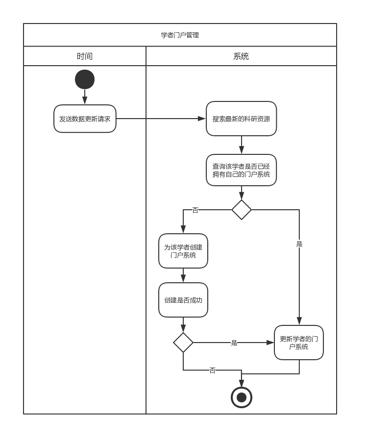
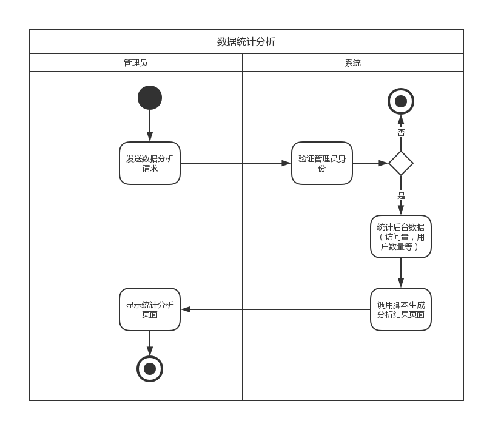

## 数据分析

### 学者门户管理

- 简要描述：系统定期搜索最新的科研资源，并更新到特定的学者的门户系统
- 前置条件：无
- 后置条件：无
- 基本事件流：

  1. 系统发送数据更新请求（比如一个月一次或一周一次）
  2. 系统后台搜索最新的科研资源，并保存至数据库
  3. 为科研资源添加到对应学者的门户系统。如果还没有该学者的门户系统，则为该学者创建门户系统，创建成功后，再将科研资源添加到该门户系统。若创建失败，则出现异常并终止。
- 异常事件流：

  1. 系统无法未学者创建门户系统
  2. 提交错误信息给管理员
  3. 用例终止
- 参与者：时间
- 相关用例：无
- 业务规则：定期更新门户系统

### 数据统计分析

- 简要描述：管理员访问统计分析页面，系统生成数据分析页面展示网站数据信息
- 前置条件：管理员登陆成功
- 后置条件：无
- 基本事件流：

  1. 管理员访问网站统计分析页面
  2. 系统确认访问者的管理员权限，如果拥有权限则生成统计信息。
  3. 用例终止
- 异常事件流：

  1. 系统发现用户没有登录或系统发现用户没有管理员权限
  2. 提示错误信息
  3. 转到登录界面
  4. 用例终止
- 参与者：管理员、系统
- 相关用例：登陆
- 业务规则：管理员需登陆后方可查看分析结果
