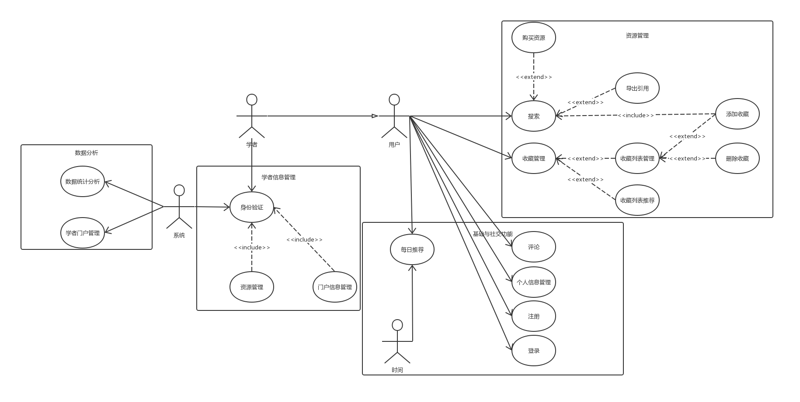
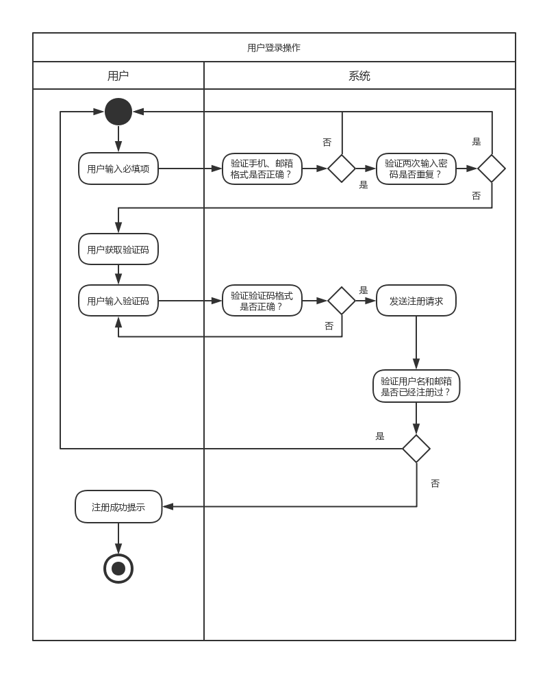
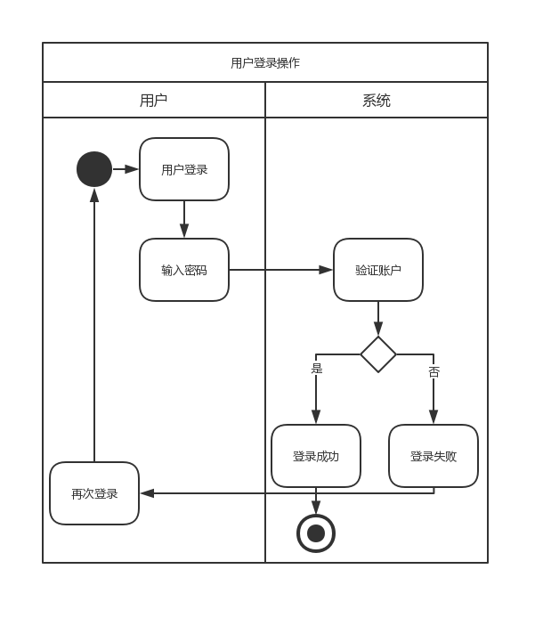
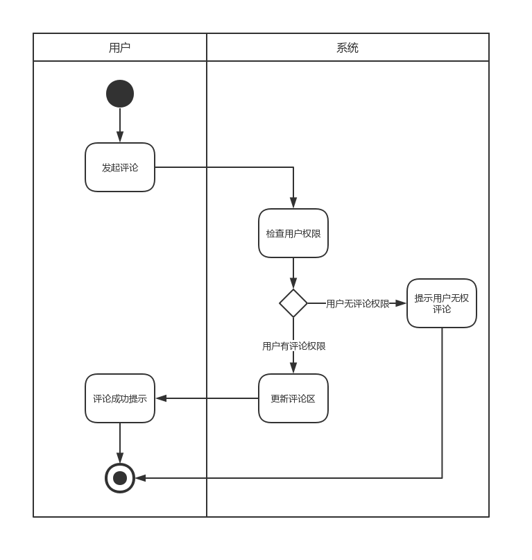
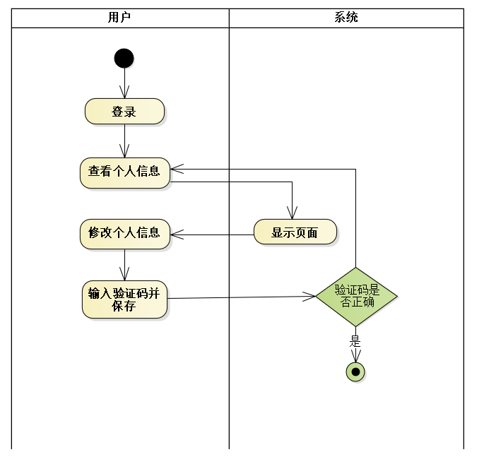
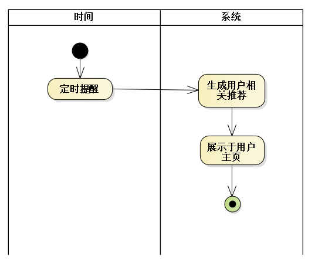

# 用例文档

## 用例图

## 用例说明

### 基础社交功能

- 注册

  

  - 注册用例用于用户在平台创建自己的账户，用户可通过手机、邮箱等方式进行注册，经验证后创建平台内唯一账户
  - 参与者：用户、系统
  - 数据需求：需要向用户的手机或邮箱发送验证码并进行验证

- 登录

  

  - 登录用例是用户登录平台的入口，用户在注册后通过输入账号密码进行登录，如果验证通过则登录成功，否则说明账号或密码有误，需要重新输入
  - 参与者：用户、系统
  - 相关用例：注册
  - 数据需求：需要用户的账号密码进行比对

- 评论

  

  - 评论用例用于用户对资源发表评论，系统验证用户权限后通过发布或拒绝发布
  - 参与者：用户、系统
  - 相关用例：登录
  - 业务规则：用户需登陆后方可进行评论

- 个人信息管理

  

  - 个人信息管理用例用于修改个人信息
  - 参与者：用户、系统
  - 相关用例：登录
  - 业务规则：用户需输入验证码后保存

- 每日推荐

  

  - 每日推荐用例用于向用户推荐信息

  - 参与者：时间、系统
