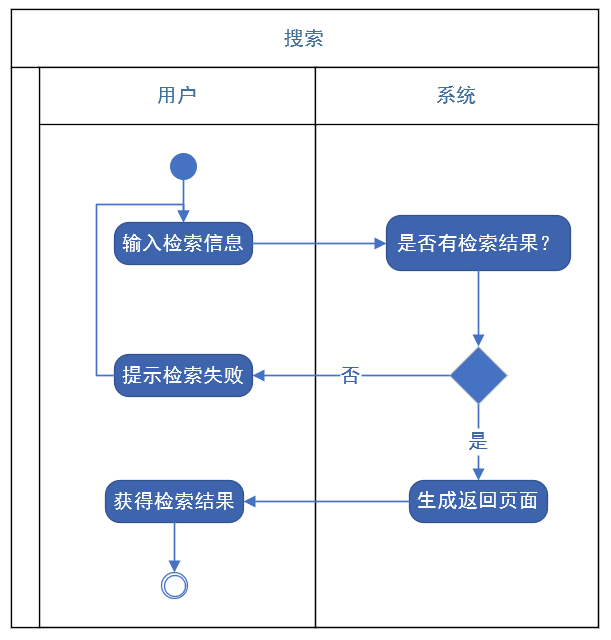
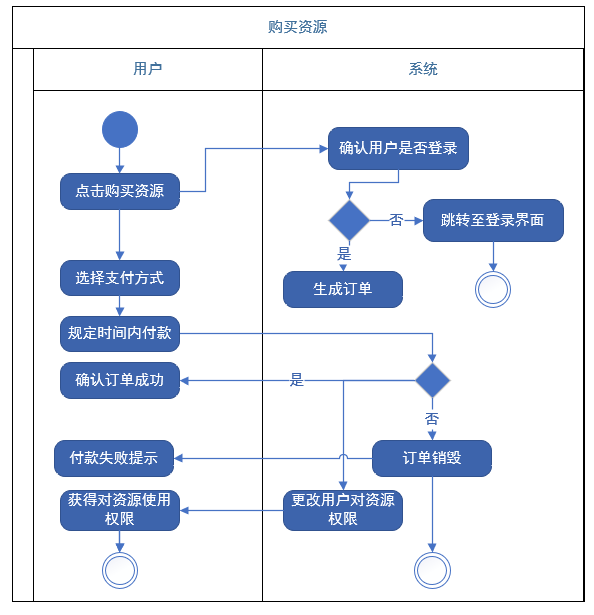
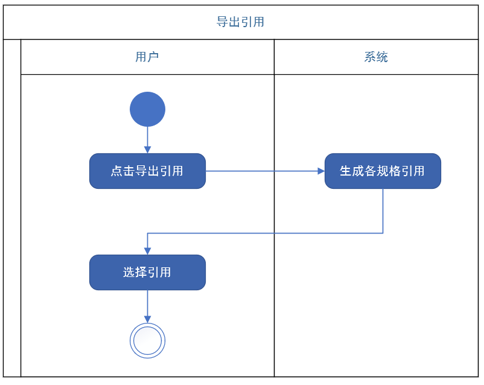
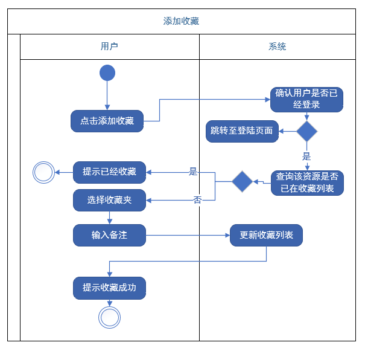

## 资源管理

### 收藏管理

- 简要描述：用户进入收藏管理的页面查看收藏夹内的资源，进而能够对已经加入收藏夹的资源做进一步操作
- 前置条件：用户登录成功
- 后置条件：无
- 基本事件流：

  1. 用户点击收藏管理按钮
  2. 系统判断是否是由已经登陆的用户发出的请求，跳转到收藏管理的页面
  3. 用例终止
- 异常事件流：

  1. 用户点击收藏管理按钮
  2. 系统发现用户没有登录
  3. 提示错误信息
  4. 转到登录界面
  5. 用例终止
- 参与者：用户、系统
- 相关用例：登录
- 业务规则：用户需登陆后方可进行评论

### 收藏列表管理

- 简要描述：用户开启对列表的管理模式，进而能够对收藏列表内的资源进行增加和删除操作
- 前置条件：进入收藏管理页面
- 后置条件：无
- 基本事件流：

  1. 用户点击列表管理按钮
  2. 系统收到请求，基于用户管理权限
  3. 用例终止
- 参与者：用户、系统
- 相关用例：收藏管理
- 业务规则：用户需进入收藏管理页面后才能对收藏列表进行管理

### 收藏列表推荐

- 简要描述：生成收藏列表的推荐链接
- 前置条件：进入收藏管理页面
- 后置条件：无
- 基本事件流：

  1. 用户点击列表管理按钮
  2. 系统收到请求，返回推荐链接
  3. 用例终止
- 参与者：用户、系统
- 相关用例：收藏管理
- 业务规则：用户需进入收藏管理页面后才能对收藏列表进行推荐

### 删除收藏

- 简要描述：用户将指定资源从收藏列表中删除
- 前置条件：用户进入收藏列表管理模式
- 后置条件：无
- 基本事件流：

  1. 用户点击列表管理按钮
  2. 系统收到请求，将资源从该用户的收藏列表中删除
  3. 用例终止
- 参与者：用户、系统
- 相关用例：收藏列表管理
- 业务规则：用户需进入收藏列表管理模式后才能进行删除

### 搜索

- 用户可以在该平台上通过输入关键词等信息检索资源，系统检索成功则返回检索结果，否则提示检索失败。

- 参与者：用户、系统

- 后置条件：检索成功后，用户可以对资源进行购买，收藏，导出引用

- 数据需求：需要将用户输入和数据库资源进行比对

### 购买资源

- 用户可以在登录状态下通过点击购买资源来生成订单，选择支付方式后在规定时间内付款即可对资源的使用权限。

- 参与者：用户，系统

- 前置条件：用户已经登录

- 相关用例：登录，搜索

### 导出引用

   

- 用户可以通过点击导出引用跳转至新页面，在系统生成的各规格引用中，选择一个规格的引用

- 参与者：用户，系统

- 相关用例：搜索

### 添加收藏

- 用户在登录状态下可以通过点击添加收藏，将当前资源收藏在指定收藏夹中，并进行备注。

- 参与者：用户，系统

- 相关用例：登陆，搜索

- 前置条件：用户已经登录

- 数据需求：需要将当前资源和收藏列表中的资源进行比对。

